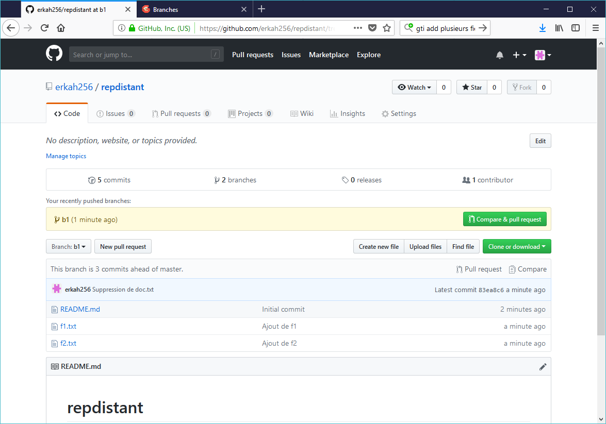
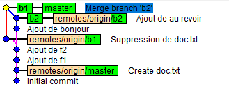
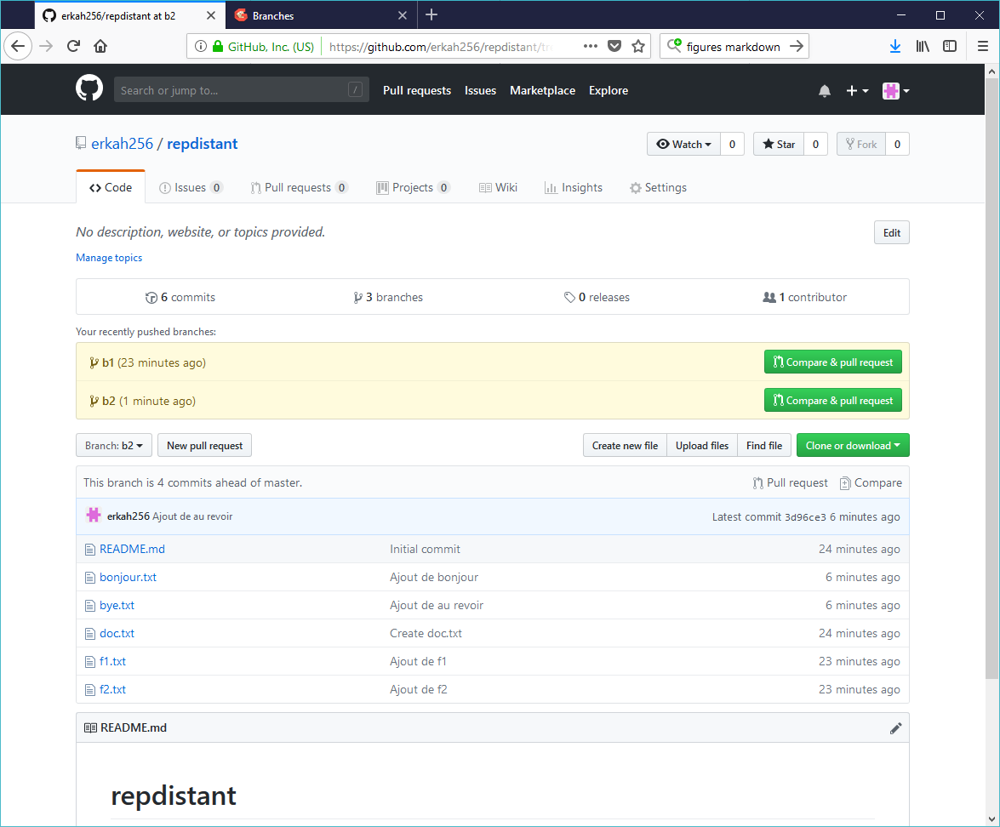

# Branches

## Clonage du dépôt distant

On clone le dépôt distant avec ses deux ("fichiers doc.txt" et "readme.md") dans le répertoire local, et on vérifie que tout est correct.
```bash
Rudy@Hermes MINGW64 /d/masterCCI/Toto
$ git clone https://github.com/erkah256/repdistant
Cloning into 'repdistant'...
remote: Enumerating objects: 6, done.
remote: Counting objects: 100% (6/6), done.
remote: Compressing objects: 100% (3/3), done.
remote: Total 6 (delta 0), reused 0 (delta 0), pack-reused 0
Unpacking objects: 100% (6/6), done.

Rudy@Hermes MINGW64 /d/masterCCI/Toto
$ cd repdistant

Rudy@Hermes MINGW64 /d/masterCCI/Toto/repdistant (master)
$ ls
doc.txt  README.md

Rudy@Hermes MINGW64 /d/masterCCI/Toto/repdistant (master)
$ git status
On branch master
Your branch is up to date with 'origin/master'.

nothing to commit, working tree clean
```

## Création d'une nouvelle branche b1 et fusion dans le master après quelques comits

Une nouvelle branche nommée b1 est créée puis sélectionnée.
```bash
Rudy@Hermes MINGW64 /d/masterCCI/Toto/repdistant (master)
$ git branch b1

Rudy@Hermes MINGW64 /d/masterCCI/Toto/repdistant (master)
$ git checkout b1
Switched to branch 'b1'
```

On réalise trois modifications sucessives : ajout de "f1.txt", de "f2.txt" et suppression de "doct.txt", chacune donnant lieu à un comit.
```bash
Rudy@Hermes MINGW64 /d/masterCCI/Toto/repdistant (b1)
$ echo "Premier fichier" >> f1.txt

Rudy@Hermes MINGW64 /d/masterCCI/Toto/repdistant (b1)
$ git add f1.txt
warning: LF will be replaced by CRLF in f1.txt.
The file will have its original line endings in your working directory.

Rudy@Hermes MINGW64 /d/masterCCI/Toto/repdistant (b1)
$ git commit -am "Ajout de f1"
warning: LF will be replaced by CRLF in f1.txt.
The file will have its original line endings in your working directory.
[b1 fbe6db2] Ajout de f1
 1 file changed, 1 insertion(+)
 create mode 100644 f1.txt

Rudy@Hermes MINGW64 /d/masterCCI/Toto/repdistant (b1)
$ echo "Second fichier" >> f2.txt

Rudy@Hermes MINGW64 /d/masterCCI/Toto/repdistant (b1)
$ git add f2.txt
warning: LF will be replaced by CRLF in f2.txt.
The file will have its original line endings in your working directory.

Rudy@Hermes MINGW64 /d/masterCCI/Toto/repdistant (b1)
$ git commit -am  "Ajout de f2"
[b1 48b9a9a] Ajout de f2
 1 file changed, 1 insertion(+)
 create mode 100644 f2.txt

Rudy@Hermes MINGW64 /d/masterCCI/Toto/repdistant (b1)
$ git rm doc.txt
rm 'doc.txt'

Rudy@Hermes MINGW64 /d/masterCCI/Toto/repdistant (b1)
$ git commit -am  "Suppression de doc.txt"
[b1 83ea8c6] Suppression de doc.txt
 1 file changed, 1 deletion(-)
 delete mode 100644 doc.txt
```
Ces comits sont ensuites fusionnés dans le master.
```bash
Rudy@Hermes MINGW64 /d/masterCCI/Toto/repdistant (b1)
$ git checkout master
Switched to branch 'master'
Your branch is up to date with 'origin/master'.

Rudy@Hermes MINGW64 /d/masterCCI/Toto/repdistant (master)
$ git merge b1
Updating 2304a57..83ea8c6
Fast-forward
 doc.txt | 1 -
 f1.txt  | 1 +
 f2.txt  | 1 +
 3 files changed, 2 insertions(+), 1 deletion(-)
 delete mode 100644 doc.txt
 create mode 100644 f1.txt
 create mode 100644 f2.txt
```

## Envoi de la branche b1 sur le serveur


La branche b1 est alors envoyée vers le dépôt distant. On voit bien sur la figure ci-dessus que "doc.txt" a été suprrimé alors que "f1.txt" et "f2.txt" ont été ajoutée.

La figure ci-dessus montre que cette branche bien visible sur le serveur.
```bash
Rudy@Hermes MINGW64 /d/masterCCI/Toto/repdistant (master)
$ git push --set-upstream origin b1
Enumerating objects: 9, done.
Counting objects: 100% (9/9), done.
Delta compression using up to 8 threads.
Compressing objects: 100% (6/6), done.
Writing objects: 100% (8/8), 701 bytes | 701.00 KiB/s, done.
Total 8 (delta 2), reused 0 (delta 0)
remote: Resolving deltas: 100% (2/2), done.
remote:
remote: Create a pull request for 'b1' on GitHub by visiting:
remote:      https://github.com/erkah256/repdistant/pull/new/b1
remote:
To https://github.com/erkah256/repdistant
 * [new branch]      b1 -> b1
Branch 'b1' set up to track remote branch 'b1' from 'origin'.
```
## Création d'une nouvelle branche b1 et fusion dans le master après quelques comits

On crée une une branche b2 à partir du commit précédant le master courant, et on sélectionne cette branche.
```bash
Rudy@Hermes MINGW64 /d/masterCCI/Toto/repdistant (master)
$ git checkout HEAD~1
Note: checking out 'HEAD~1'.

You are in 'detached HEAD' state. You can look around, make experimental
changes and commit them, and you can discard any commits you make in this
state without impacting any branches by performing another checkout.

If you want to create a new branch to retain commits you create, you may
do so (now or later) by using -b with the checkout command again. Example:

  git checkout -b <new-branch-name>

HEAD is now at 48b9a9a Ajout de f2

Rudy@Hermes MINGW64 /d/masterCCI/Toto/repdistant ((48b9a9a...))
$ git branch b2

Rudy@Hermes MINGW64 /d/masterCCI/Toto/repdistant ((48b9a9a...))
$ git checkout b2
Switched to branch 'b2'
```
On réalise deux commits correspondant à l'ajout des fichiers "bonjour.txt" et "bye.txt".
```bash
Rudy@Hermes MINGW64 /d/masterCCI/Toto/repdistant (b2)
$ echo "Bonjour tout le monde, ça va" >> bonjour.txt

Rudy@Hermes MINGW64 /d/masterCCI/Toto/repdistant (b2)
$ git add bonjour.txt
warning: LF will be replaced by CRLF in bonjour.txt.
The file will have its original line endings in your working directory.

Rudy@Hermes MINGW64 /d/masterCCI/Toto/repdistant (b2)
$ git commit -am  "Ajout de bonjour"
warning: LF will be replaced by CRLF in bonjour.txt.
The file will have its original line endings in your working directory.
[b2 051218c] Ajout de bonjour
 1 file changed, 1 insertion(+)
 create mode 100644 bonjour.txt

Rudy@Hermes MINGW64 /d/masterCCI/Toto/repdistant (b2)
$ echo "Au revoir" >> bye.txt

Rudy@Hermes MINGW64 /d/masterCCI/Toto/repdistant (b2)
$ git add bye.txt
warning: LF will be replaced by CRLF in bye.txt.
The file will have its original line endings in your working directory.

Rudy@Hermes MINGW64 /d/masterCCI/Toto/repdistant (b2)
$ git commit -am  "Ajout de au revoir"
warning: LF will be replaced by CRLF in bye.txt.
The file will have its original line endings in your working directory.
[b2 3d96ce3] Ajout de au revoir
 1 file changed, 1 insertion(+)
 create mode 100644 bye.txt

Rudy@Hermes MINGW64 /d/masterCCI/Toto/repdistant (b2)
$ git checkout master
Switched to branch 'master'
Your branch is ahead of 'origin/master' by 3 commits.
  (use "git push" to publish your local commits)
```

On fusionne ensuite ces comits dans le master.
```bash
Rudy@Hermes MINGW64 /d/masterCCI/Toto/repdistant (b2)
$ git checkout master
Switched to branch 'master'
Your branch is ahead of 'origin/master' by 3 commits.
  (use "git push" to publish your local commits)

Rudy@Hermes MINGW64 /d/masterCCI/Toto/repdistant (master)
$ git merge b2
Merge made by the 'recursive' strategy.
 bonjour.txt | 1 +
 bye.txt     | 1 +
 2 files changed, 2 insertions(+)
 create mode 100644 bonjour.txt
 create mode 100644 bye.txt
```

## Fusion du master dans b1

On fusionne le master dans b1
```bash
Rudy@Hermes MINGW64 /d/masterCCI/Toto/repdistant (master)
$ git checkout b1
git log --graph --oneline --decorate
git push --set-upstream origin b2Switched to branch 'b1'
Your branch is up to date with 'origin/b1'.

Rudy@Hermes MINGW64 /d/masterCCI/Toto/repdistant (b1)
$ git merge master
Updating 83ea8c6..1b56401
Fast-forward
 bonjour.txt | 1 +
 bye.txt     | 1 +
 2 files changed, 2 insertions(+)
 create mode 100644 bonjour.txt
 create mode 100644 bye.txt
```

On vérifie le graphe des commits avec le client Git console
```bash
Rudy@Hermes MINGW64 /d/masterCCI/Toto/repdistant (b1)
$ git log --graph --oneline --decorate
*   1b56401 (HEAD -> b1, master) Merge branch 'b2'
|\
| * 3d96ce3 (b2) Ajout de au revoir
| * 051218c Ajout de bonjour
* | 83ea8c6 (origin/b1) Suppression de doc.txt
|/
* 48b9a9a Ajout de f2
* fbe6db2 Ajout de f1
* 2304a57 (origin/master, origin/HEAD) Create doc.txt
* 676d872 Initial commit
```



L'outil graphique gitk permet d'obtenir une vue plus "ergonomique" de ce graphe. On voit ainsi que dans la branche b2, on a les modifications suivantes : ajouts de "f1" et "f2", "bonjour.txt" et "bye.txt"., mais pas la suppression de "doc.txt".

## Envoi de la branche b2 sur le serveur puis suppression sur le dépôt local puis sur le dépôt distant.


La branche b2 est envoyée sur le serveur. On peut constater que le résultat est conforme aux modifications que l'on vient d'évoquer.

```bash
Rudy@Hermes MINGW64 /d/masterCCI/Toto/repdistant (b1)
$ git push --set-upstream origin b2
Enumerating objects: 7, done.
Counting objects: 100% (7/7), done.
Delta compression using up to 8 threads.
Compressing objects: 100% (4/4), done.
Writing objects: 100% (6/6), 607 bytes | 607.00 KiB/s, done.
Total 6 (delta 1), reused 0 (delta 0)
remote: Resolving deltas: 100% (1/1), done.
remote:
remote: Create a pull request for 'b2' on GitHub by visiting:
remote:      https://github.com/erkah256/repdistant/pull/new/b2
remote:
To https://github.com/erkah256/repdistant
 * [new branch]      b2 -> b2
Branch 'b2' set up to track remote branch 'b2' from 'origin'.
```
Pour finir, on supprime la branche b2 du dépôt local, puis du dépôt distant.

```bash
Rudy@Hermes MINGW64 /d/masterCCI/Toto/repdistant (b1)
$ git branch -d b2
Deleted branch b2 (was 3d96ce3).

Rudy@Hermes MINGW64 /d/masterCCI/Toto/repdistant (b1)
$ git branch
* b1
  master

Rudy@Hermes MINGW64 /d/masterCCI/Toto/repdistant (b1)
$ git push --delete origin b2
To https://github.com/erkah256/repdistant
 - [deleted]         b2
```


