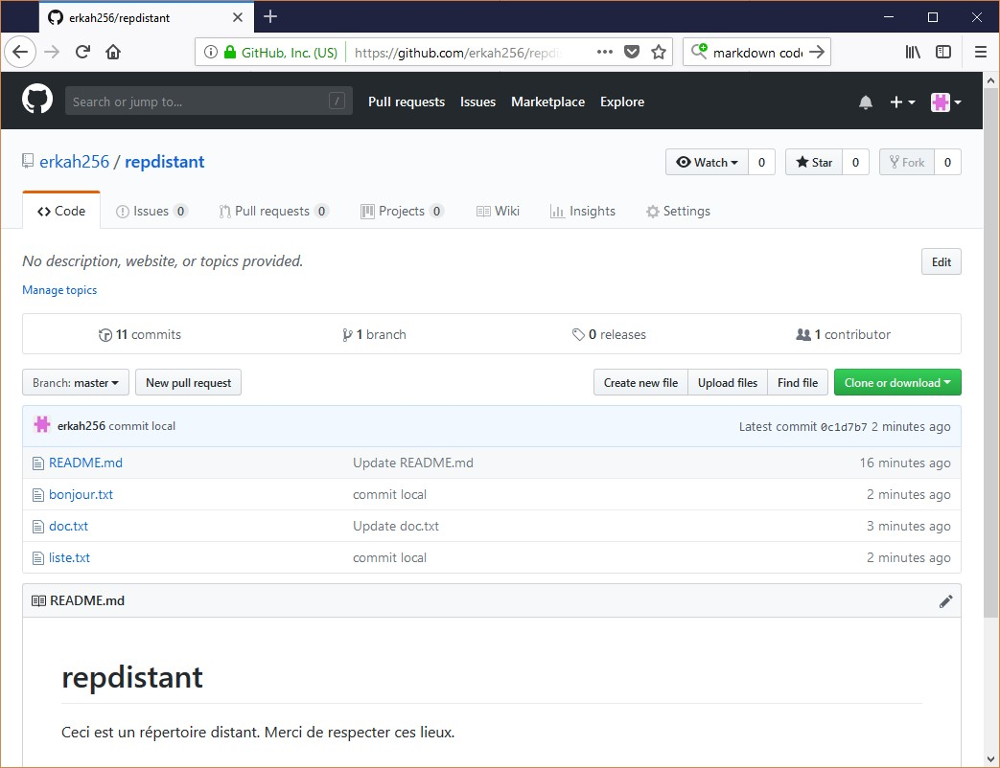
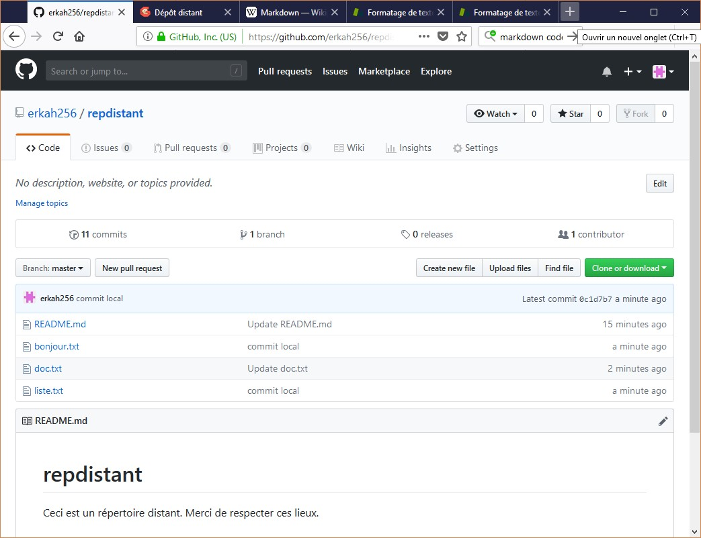
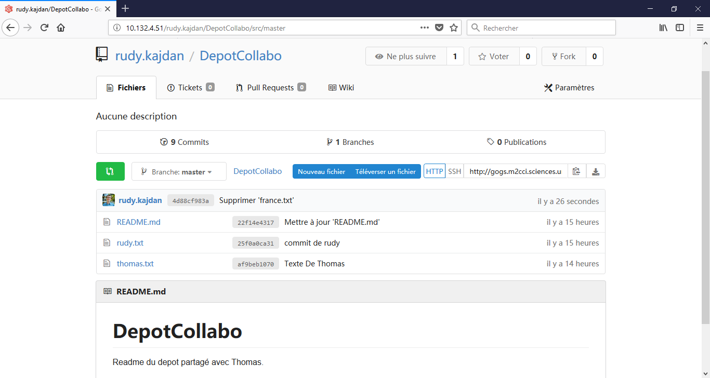
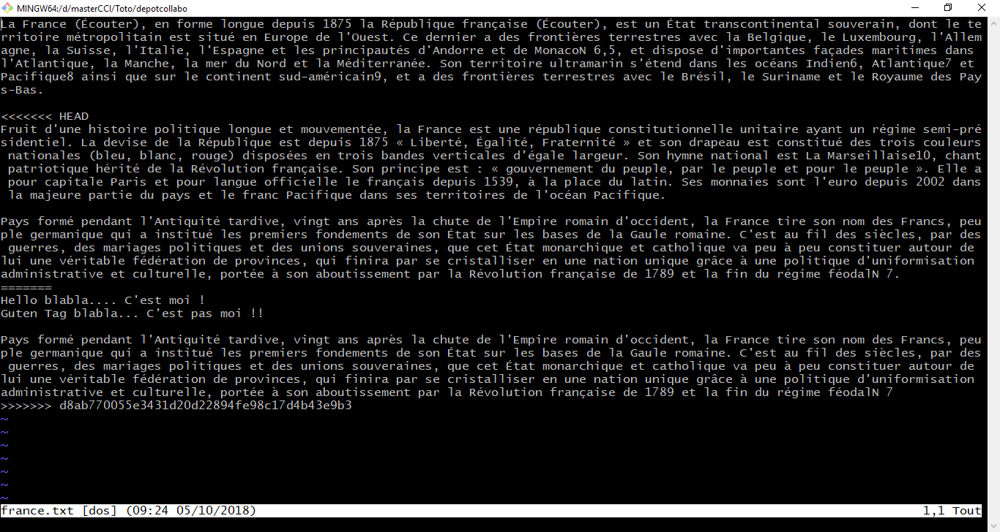
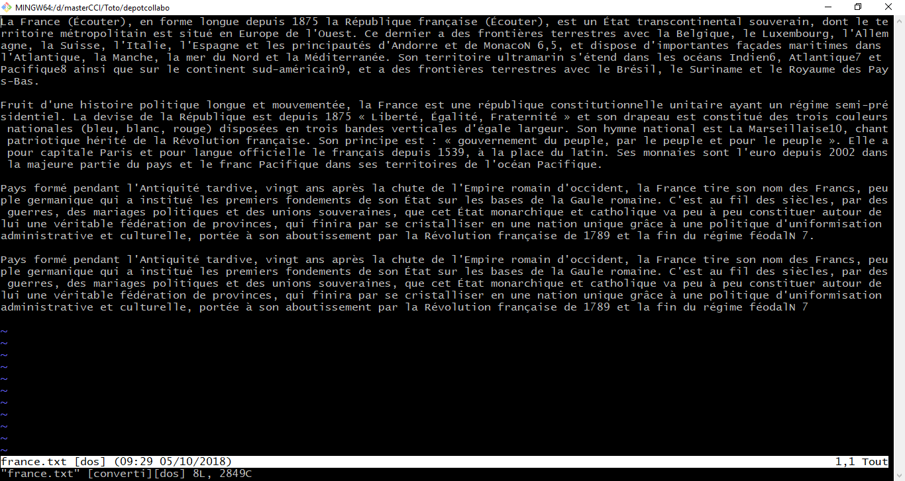

# Dépôt distant

## Exercice 1

### Création d'un dépôt distant et récupération des données


On commence par créer un dépôt distant sur github. On ajoute ensuite les fichiers suivants : readme.md et doc.txt, comme l'atteste la figure ci-dessus.

On clone avec la commande git clone ce dépôt dans le répertoire courant et l'on s'assure que les fichiers sont bien présents (commande ls).

```bash
Rudy@Hermes MINGW64 /d/masterCCI/Toto
$ git clone https://github.com/erkah256/repdistant
Cloning into 'repdistant'...
remote: Enumerating objects: 28, done.
remote: Counting objects: 100% (28/28), done.
remote: Compressing objects: 100% (20/20), done.
remote: Total 28 (delta 2), reused 14 (delta 2), pack-reused 0
Unpacking objects: 100% (28/28), done.

Rudy@Hermes MINGW64 /d/masterCCI/Toto
$ cd repdistant

Rudy@Hermes MINGW64 /d/masterCCI/Toto/repdistant (master)
$ ls
doc.txt  README.md

Rudy@Hermes MINGW64 /d/masterCCI/Toto/repdistant (master)
$ git status
On branch master
Your branch is up to date with 'origin/master'.

nothing to commit, working tree clean
```

### Ajout de fichiers en local et envoi des modifications vers le répertoire distant

On ajoute deux fichiers en local dans l'arbre de travail : bonjour.txt et liste.txt, puis on réalise un commit.
```bash

Rudy@Hermes MINGW64 /d/masterCCI/Toto/repdistant (master)
$ echo "Bonjour tout le monde, รงa va" >> bonjour.txt

Rudy@Hermes MINGW64 /d/masterCCI/Toto/repdistant (master)
$ ls >> liste.txt

Rudy@Hermes MINGW64 /d/masterCCI/Toto/repdistant (master)
$ git add liste.txt
warning: LF will be replaced by CRLF in liste.txt.
The file will have its original line endings in your working directory.

Rudy@Hermes MINGW64 /d/masterCCI/Toto/repdistant (master)
$ git add bonjour.txt
warning: LF will be replaced by CRLF in bonjour.txt.
The file will have its original line endings in your working directory.

Rudy@Hermes MINGW64 /d/masterCCI/Toto/repdistant (master)
$ git status
On branch master
Your branch is up to date with 'origin/master'.

Changes to be committed:
  (use "git reset HEAD <file>..." to unstage)

        new file:   bonjour.txt
        new file:   liste.txt


Rudy@Hermes MINGW64 /d/masterCCI/Toto/repdistant (master)
$ git commit -am "commit local"
[master 0c1d7b7] commit local
 2 files changed, 5 insertions(+)
 create mode 100644 bonjour.txt
 create mode 100644 liste.txt
```

On envoie les modifications vers le dépôt distant avec un push
```bash
Rudy@Hermes MINGW64 /d/masterCCI/Toto/repdistant (master)
$ git push
Enumerating objects: 5, done.
Counting objects: 100% (5/5), done.
Delta compression using up to 8 threads.
Compressing objects: 100% (2/2), done.
Writing objects: 100% (4/4), 404 bytes | 404.00 KiB/s, done.
Total 4 (delta 0), reused 0 (delta 0)
To https://github.com/erkah256/repdistant
   e1e5abf..0c1d7b7  master -> master
```
Le résultat est visible sur la copie d'écran ci-dessous :



## Exercice 2

### Ajouts de fichier dans n dossier partagé avec un collègue

On commence par cloner sur le disque dur le nouveau dépôt de Gogs partagé avec Thomas.
```bash
Rudy@Hermes MINGW64 /d/masterCCI/Toto
$ git clone http://gogs.m2cci.sciences.univ-tours.fr/rudy.kajdan/DepotCollabo.git
Cloning into 'DepotCollabo'...
remote: Counting objects: 6, done.
remote: Compressing objects: 100% (3/3), done.
remote: Total 6 (delta 0), reused 0 (delta 0)
Unpacking objects: 100% (6/6), done.

Rudy@Hermes MINGW64 /d/masterCCI/Toto
$ cd DepotCollabo

Rudy@Hermes MINGW64 /d/masterCCI/Toto/DepotCollabo (master)
$ ls
README.md

Rudy@Hermes MINGW64 /d/masterCCI/Toto/DepotCollabo (master)
$ git status
On branch master
Your branch is up to date with 'origin/master'.

nothing to commit, working tree clean
````
On constate que l'on a bien récupéré le fichier readme.md. On ajoute alors un fichier, nommé "rudy.txt" pour que Thomas puisse le récupérer.
```bash
Rudy@Hermes MINGW64 /d/masterCCI/Toto/DepotCollabo (master)
$ git status
On branch master
Your branch is up to date with 'origin/master'.

nothing to commit, working tree clean

Rudy@Hermes MINGW64 /d/masterCCI/Toto/DepotCollabo (master)
$ echo "Fichier de rudy" >> rudy.txt

Rudy@Hermes MINGW64 /d/masterCCI/Toto/DepotCollabo (master)
$ git add rudy.txt
warning: LF will be replaced by CRLF in rudy.txt.
The file will have its original line endings in your working directory.

Rudy@Hermes MINGW64 /d/masterCCI/Toto/DepotCollabo (master)
$ git status
On branch master
Your branch is up to date with 'origin/master'.

Changes to be committed:
  (use "git reset HEAD <file>..." to unstage)

        new file:   rudy.txt


Rudy@Hermes MINGW64 /d/masterCCI/Toto/DepotCollabo (master)
$ git commit -am "commit de rudy"
[master 25f0a0c] commit de rudy
 1 file changed, 1 insertion(+)
 create mode 100644 rudy.txt

Rudy@Hermes MINGW64 /d/masterCCI/Toto/DepotCollabo (master)
$ git status
On branch master
Your branch is ahead of 'origin/master' by 1 commit.
  (use "git push" to publish your local commits)

nothing to commit, working tree clean

Rudy@Hermes MINGW64 /d/masterCCI/Toto/DepotCollabo (master)
$ git push
Enumerating objects: 4, done.
Counting objects: 100% (4/4), done.
Delta compression using up to 8 threads.
Compressing objects: 100% (2/2), done.
Writing objects: 100% (3/3), 285 bytes | 285.00 KiB/s, done.
Total 3 (delta 0), reused 0 (delta 0)
To http://gogs.m2cci.sciences.univ-tours.fr/rudy.kajdan/DepotCollabo.git
   22f14e4..25f0a0c  master -> master
```



### Récupération des modifications réalisées par un collègue sur le dépôt distant

Thomas ajoute ensuite un fichier nommé "thomas.txt" comme on peut le voir sur la figure ci-dessus. On effectue alors un pull afin de récupérer ce nouveau fichier.

```bash
Rudy@Hermes MINGW64 /d/masterCCI/Toto/DepotCollabo (master)
$ git pull
remote: Counting objects: 5, done.
remote: Compressing objects: 100% (4/4), done.
remote: Total 5 (delta 0), reused 0 (delta 0)
Unpacking objects: 100% (5/5), done.
From http://gogs.m2cci.sciences.univ-tours.fr/rudy.kajdan/DepotCollabo
   25f0a0c..cbef611  master     -> origin/master
Updating 25f0a0c..cbef611
Fast-forward
 thomas.txt | 0
 1 file changed, 0 insertions(+), 0 deletions(-)
 create mode 100644 thomas.txt

Rudy@Hermes MINGW64 /d/masterCCI/Toto/DepotCollabo (master)
$ ls
README.md  rudy.txt  thomas.txt
```

### Génération d'un conflit

Thomas envoie sur le dépôt Gogs un fichier "france.txt" consituté de quatre paragraphes. En parallèle, on ajoute dans le répertoire local un fichier égaleamant nommé "france.txt" mais qui diffère par le troisième paragraphe.

```bash
Rudy@Hermes MINGW64 /d/masterCCI/Toto/depotcollabo (master)
$ git add france.txt

Rudy@Hermes MINGW64 /d/masterCCI/Toto/depotcollabo (master)
$ ls
france.txt  README.md  rudy.txt  thomas.txt

Rudy@Hermes MINGW64 /d/masterCCI/Toto/depotcollabo (master)
$ git status
On branch master
Your branch is up to date with 'origin/master'.

Changes to be committed:
  (use "git reset HEAD <file>..." to unstage)

        new file:   france.txt

Rudy@Hermes MINGW64 /d/masterCCI/Toto/depotcollabo (master)
$ git commit -am "commit de france par rudy"
[master 4b832c5] commit de france par rudy
 1 file changed, 5 insertions(+)
 create mode 100644 france.txt
```

Lorsque l'on essaie de réaliser un "pull", un conflit se produit.
```bash
Rudy@Hermes MINGW64 /d/masterCCI/Toto/depotcollabo (master)
$ git pull
remote: Counting objects: 3, done.
remote: Compressing objects: 100% (3/3), done.
remote: Total 3 (delta 0), reused 0 (delta 0)
Unpacking objects: 100% (3/3), done.
From http://gogs.m2cci.sciences.univ-tours.fr/rudy.kajdan/DepotCollabo
   f46d592..d8ab770  master     -> origin/master
Auto-merging france.txt
CONFLICT (add/add): Merge conflict in france.txt
Automatic merge failed; fix conflicts and then commit the result.
```

### Résolution du conflit


Afin de résoudre le conflit, on ouvre le fichier "france.txt" qui vient d'être modifié dans le répertoire local (voir figure ci-dessus). On remarque la présence de marques indiquant le paragraphe en conflit. On modifie donc ce paragraphe afin de le faire correspondre à ce que l'on souhaite (figure ci-dessous), puis l'on réalise un commit suivi d'un push sur le serveur distant.


```bash
Rudy@Hermes MINGW64 /d/masterCCI/Toto/DepotCollabo (master|MERGING)
$ git status
On branch master
Your branch and 'origin/master' have diverged,
and have 1 and 1 different commits each, respectively.
  (use "git pull" to merge the remote branch into yours)

You have unmerged paths.
  (fix conflicts and run "git commit")
  (use "git merge --abort" to abort the merge)

Unmerged paths:
  (use "git add <file>..." to mark resolution)

        both added:      france.txt

no changes added to commit (use "git add" and/or "git commit -a")

Rudy@Hermes MINGW64 /d/masterCCI/Toto/DepotCollabo (master|MERGING)
$ git commit -am "resolution conflit par rudy"
[master 66ac643] resolution conflit par rudy

Rudy@Hermes MINGW64 /d/masterCCI/Toto/DepotCollabo (master)
$ git push
Enumerating objects: 9, done.
Counting objects: 100% (9/9), done.
Delta compression using up to 8 threads.
Compressing objects: 100% (6/6), done.
Writing objects: 100% (6/6), 1.00 KiB | 1.00 MiB/s, done.
Total 6 (delta 4), reused 0 (delta 0)
To http://gogs.m2cci.sciences.univ-tours.fr/rudy.kajdan/DepotCollabo.git
   d8ab770..66ac643  master -> master

Rudy@Hermes MINGW64 /d/masterCCI/Toto/DepotCollabo (master)
$ git pull
Already up to date.
```


