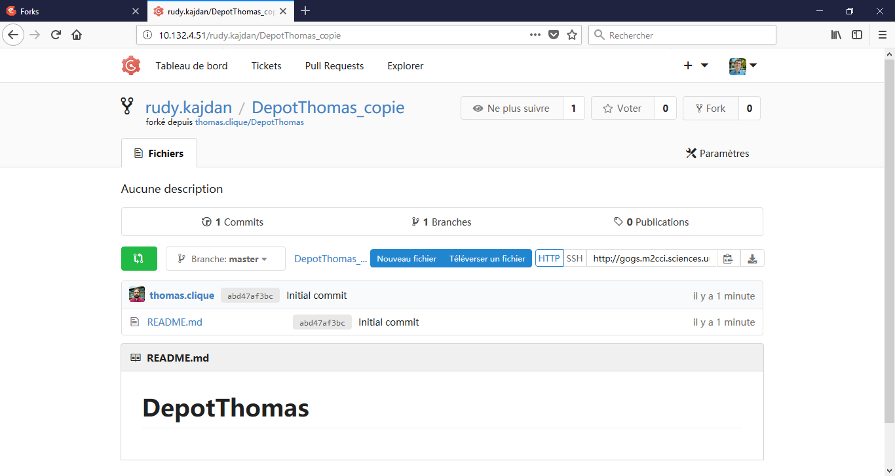
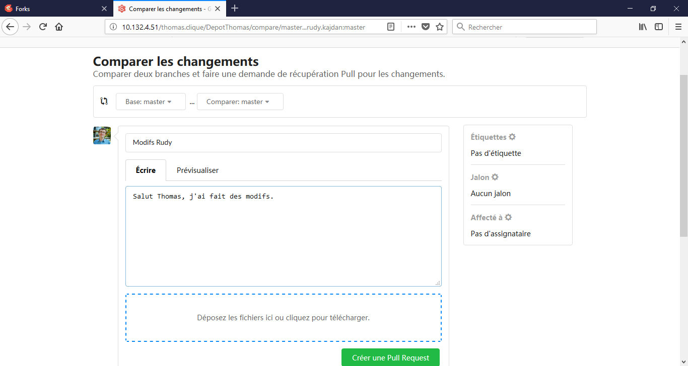
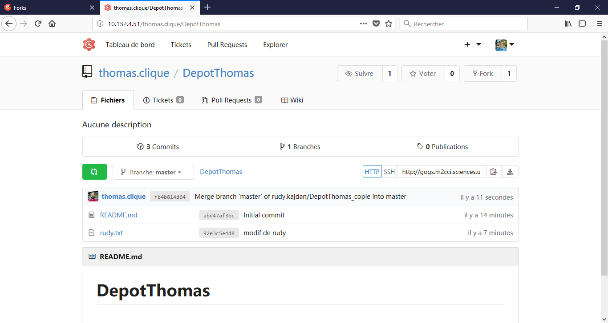

# Forks

## Exercice 1

### Réalisation d'un fork



On commence par forker le dépôt public "DepotThomas" de Thomas. On nomme "DepotThomasCopie" le fork puis on le clone dans un dépôt local.

```bash
Rudy@Hermes MINGW64 /d/masterCCI/Toto
$ git clone http://gogs.m2cci.sciences.univ-tours.fr/rudy.kajdan/DepotThomas_copie.git
Cloning into 'DepotThomas_copie'...
remote: Counting objects: 3, done.
remote: Total 3 (delta 0), reused 0 (delta 0)
Unpacking objects: 100% (3/3), done.

Rudy@Hermes MINGW64 /d/masterCCI/Toto
$ ls
'batch collabo githu.sh'   batch2.sh   DepotCollabo/        rudy.txt
'batch collabo.sh'         batch3.sh   DepotThomas_copie/
 batch.sh                  bob/        repdistant/

Rudy@Hermes MINGW64 /d/masterCCI/Toto
$ cd depotthomas_copie

Rudy@Hermes MINGW64 /d/masterCCI/Toto/depotthomas_copie (master)
$ ls
README.md
```
### Mise à jour du dépôt forké

On ajoute ensuite un nouveau fichier nommé "rudy.txt" dans le dépôt forké.
```bash
Rudy@Hermes MINGW64 /d/masterCCI/Toto/depotthomas_copie (master)
$ echo "modifications de rudy" >> rudy.txt

Rudy@Hermes MINGW64 /d/masterCCI/Toto/depotthomas_copie (master)
$ git add rudy.txt
warning: LF will be replaced by CRLF in rudy.txt.
The file will have its original line endings in your working directory.

Rudy@Hermes MINGW64 /d/masterCCI/Toto/depotthomas_copie (master)
$ git status
On branch master
Your branch is up to date with 'origin/master'.

Changes to be committed:
  (use "git reset HEAD <file>..." to unstage)

        new file:   rudy.txt


Rudy@Hermes MINGW64 /d/masterCCI/Toto/depotthomas_copie (master)
$ git commit -am "modif de rudy"
[master 92e3c5e] modif de rudy
 1 file changed, 1 insertion(+)
 create mode 100644 rudy.txt

Rudy@Hermes MINGW64 /d/masterCCI/Toto/depotthomas_copie (master)
$ git push
Enumerating objects: 4, done.
Counting objects: 100% (4/4), done.
Delta compression using up to 8 threads.
Compressing objects: 100% (2/2), done.
Writing objects: 100% (3/3), 295 bytes | 295.00 KiB/s, done.
Total 3 (delta 0), reused 0 (delta 0)
To http://gogs.m2cci.sciences.univ-tours.fr/rudy.kajdan/DepotThomas_copie.git
   abd47af..92e3c5e  master -> master
```

### Pull request



On fait un pull request (figure ci-dessus). Après acceptation, on constate que le dépôt d'origine et le dépôt forké se sont bien synchronisés. (figure ci-dessous)




## Exerice 2

On commence par créer deux dépôts distants nommés "DepotPrive" et "DepotPublic".

Le dépôt privé est cloné sur le disque local, avec son contenu, le fichier readme.md
```bash
Rudy@Hermes MINGW64 /d/masterCCI/Toto
$ git clone https://github.com/erkah256/DepotPrive
Cloning into 'DepotPrive'...
remote: Enumerating objects: 3, done.
remote: Counting objects: 100% (3/3), done.
remote: Total 3 (delta 0), reused 0 (delta 0), pack-reused 0
Unpacking objects: 100% (3/3), done.

Rudy@Hermes MINGW64 /d/masterCCI/Toto
$ cd DepotPrive

Rudy@Hermes MINGW64 /d/masterCCI/Toto/DepotPrive (master)
$ ls
README.md
```

Trois fichiers "f1.md", "f2.md" et "f3.md" sont ajoutés et font l'objet de trois commits. Ensuite le tout est poussé sur le répertoire distant "DepotPrive".

```bash
Rudy@Hermes MINGW64 /d/masterCCI/Toto/DepotPrive (master)
$ git commit -am "ajout de f1"
[master 1e92d4b] ajout de f1
 1 file changed, 1 insertion(+)
 create mode 100644 f1.md

Rudy@Hermes MINGW64 /d/masterCCI/Toto/DepotPrive (master)
$ echo "fichier 2" >> f2.md

Rudy@Hermes MINGW64 /d/masterCCI/Toto/DepotPrive (master)
$ git add f2.md
warning: LF will be replaced by CRLF in f2.md.
The file will have its original line endings in your working directory.

Rudy@Hermes MINGW64 /d/masterCCI/Toto/DepotPrive (master)
$ git commit -am "ajout de f2"
warning: LF will be replaced by CRLF in f2.md.
The file will have its original line endings in your working directory.
[master 9e41591] ajout de f2
 1 file changed, 1 insertion(+)
 create mode 100644 f2.md

Rudy@Hermes MINGW64 /d/masterCCI/Toto/DepotPrive (master)
$ echo "fichier 3" >> f3.md

Rudy@Hermes MINGW64 /d/masterCCI/Toto/DepotPrive (master)
$ git add f3.md
warning: LF will be replaced by CRLF in f3.md.
The file will have its original line endings in your working directory.

Rudy@Hermes MINGW64 /d/masterCCI/Toto/DepotPrive (master)
$ git commit -am "ajout de f3"
warning: LF will be replaced by CRLF in f3.md.
The file will have its original line endings in your working directory.
[master 24ca557] ajout de f3
 1 file changed, 1 insertion(+)
 create mode 100644 f3.md

Rudy@Hermes MINGW64 /d/masterCCI/Toto/DepotPrive (master)
$ git push origin
Enumerating objects: 10, done.
Counting objects: 100% (10/10), done.
Delta compression using up to 8 threads.
Compressing objects: 100% (6/6), done.
Writing objects: 100% (9/9), 686 bytes | 343.00 KiB/s, done.
Total 9 (delta 2), reused 0 (delta 0)
remote: Resolving deltas: 100% (2/2), done.
To https://github.com/erkah256/DepotPrive
   b46bbf8..24ca557  master -> master
```
Dans le dépôt privé local, on crée une branche dénommée "public" dans laquelle on fusionne le master.
```bash
Rudy@Hermes MINGW64 /d/masterCCI/Toto/DepotPrive (master)
$ git branch public

Rudy@Hermes MINGW64 /d/masterCCI/Toto/DepotPrive (master)
$ git checkout public
Switched to branch 'public'

Rudy@Hermes MINGW64 /d/masterCCI/Toto/DepotPrive (public)
$ git merge master
Already up to date.
```

On effectue un push de cette branche sur les deux dépôts distants.
```bash
Rudy@Hermes MINGW64 /d/masterCCI/Toto/DepotPrive (public)
$ git push --set-upstream origin public
Total 0 (delta 0), reused 0 (delta 0)
remote:
remote: Create a pull request for 'public' on GitHub by visiting:
remote:      https://github.com/erkah256/DepotPrive/pull/new/public
remote:
To https://github.com/erkah256/DepotPrive
 * [new branch]      public -> public
Branch 'public' set up to track remote branch 'public' from 'origin'.

Rudy@Hermes MINGW64 /d/masterCCI/Toto/DepotPrive (public)
$ git remote add depotPublic https://github.com/erkah256/DepotPublic

Rudy@Hermes MINGW64 /d/masterCCI/Toto/DepotPrive (public)
$ git push -u depotPublic public
Enumerating objects: 12, done.
Counting objects: 100% (12/12), done.
Delta compression using up to 8 threads.
Compressing objects: 100% (7/7), done.
Writing objects: 100% (12/12), 1.24 KiB | 633.00 KiB/s, done.
Total 12 (delta 2), reused 0 (delta 0)
remote: Resolving deltas: 100% (2/2), done.
remote:
remote: Create a pull request for 'public' on GitHub by visiting:
remote:      https://github.com/erkah256/DepotPublic/pull/new/public
remote:
To https://github.com/erkah256/DepotPublic
 * [new branch]      public -> public
Branch 'public' set up to track remote branch 'public' from 'depotPublic'.
```


